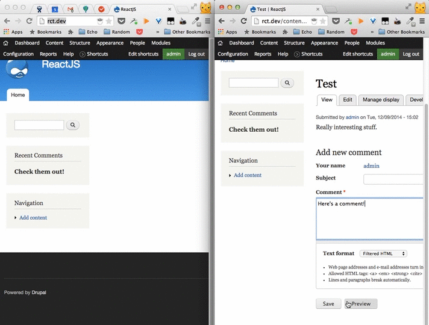

This is a simple example of a ReactJS based Recent Comments block on Drupal, structured after/inspired by the [ReactJS Tutorial](http://facebook.github.io/react/docs/tutorial.html)

Comment submission on the right, no browser refresh on the left.

## What's ReactJS?

> ### JUST THE UI
Lots of people use React as the V in MVC. Since React makes no assumptions about the rest of your technology stack, it's easy to try it out on a small feature in an existing project.

> ### VIRTUAL DOM
React uses a virtual DOM diff implementation for ultra-high performance. It can also render on the server using Node.js — no heavy browser DOM required.

> ### DATA FLOW
React implements one-way reactive data flow which reduces boilerplate and is easier to reason about than traditional data binding.

Here, these are the [ReactJS Docs](http://facebook.github.io/react/docs/getting-started.html)

This also relies on the [React](http://drupal.org/project/react) module to serve the library.

And the [Services](http://drupal.org/project/services) module to render the JSON. In renderComponent you can chagne this URL that gets polled for to whatever you want.

To use the JSX syntax do this:

`npm install -g react-tools`

`jsx --watch src/ build/`

Otherwise you can edit the `build/` directly and delete `src` to add your own react components.

Cheers! :cat: